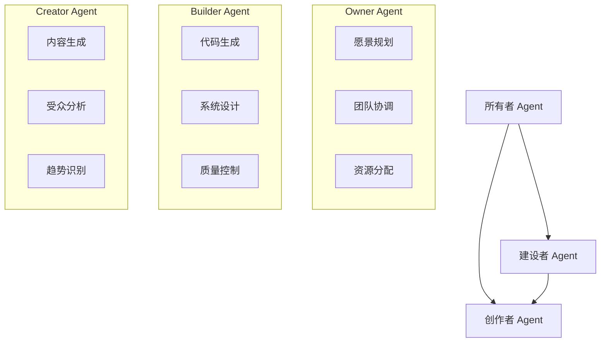

JASon，3C创业布道师序言

第一个：创作者 这个级别的人才，能专注自己感兴趣的领域，去创作内容出来。内容的形式可以是图文、音视频、直播等等，帮助人们在大量的噪音中找到自己所需要的信号。

第二个：建设者 这个级别的人才，能把业务逻辑，写成为软件代码，从而指挥机器来自动化运行某个业务。建设者是由软件工程师、用户体验设计师和产品经理等共同组成的团队。

第三个：所有者 这个级别的人才，能引领人类社会发展。首先有想象力，能提出对未来的憧憬；其次有领导力，能引领建设者开发软件、创作者产出内容；最后是有执行力，打造“人人为股东”的所有权经济乌托邦。

让我思考一下使用 AI Agents 来实现这三个角色的可行性。

基于当前AI技术，我认为这个构想具有一定可行性，让我们逐个分析：

1. 创作者Agent (Creator)
- 技术可行性：较高
- 具体能力：
  - 可以生成各类文字内容、简单图片设计
  - 能进行数据分析，识别内容趋势
  - 可以根据受众反馈优化内容方向
- 现有限制：
  - 原创性和情感共鸣方面还需提升
  - 视频内容生成仍有限制

2. 建设者Agent (Builder)
- 技术可行性：中等
- 具体能力：
  - 能生成基础代码框架
  - 可以进行简单的系统设计
  - 具备基本的代码审查能力
- 现有限制：
  - 复杂系统架构设计能力有限
  - 创新性解决方案仍需人工参与
  - 安全性考虑需要人工监督

3. 所有者Agent (Owner)
- 技术可行性：较低
- 具体能力：
  - 可以进行数据驱动的决策建议
  - 能够协调任务分配
  - 基础项目管理功能
- 现有限制：
  - 战略性思维和创新能力有限
  - 复杂的人际互动和领导力难以实现
  - 价值判断和道德决策需要人工把控

实施建议：
1. 采用混合模式：将AI Agents作为辅助工具，而非完全替代
2. 建立清晰的职责界限和决策流程
3. 设置人工监督机制，特别是在关键决策点
4. 逐步迭代，从简单任务开始，循序渐进扩展能力

## references

https://github.com/yangboz/crewAI-examples/tree/main/game-builder-crew

